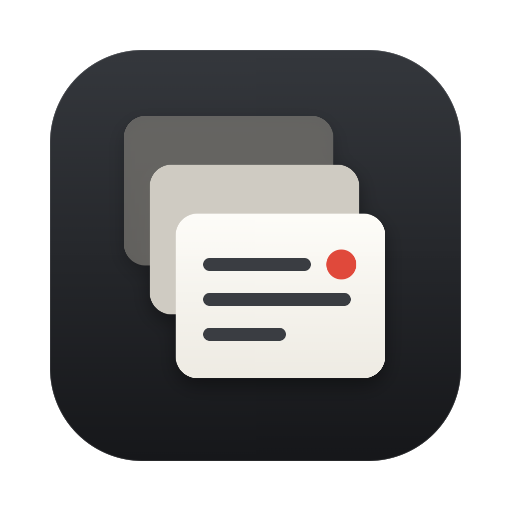
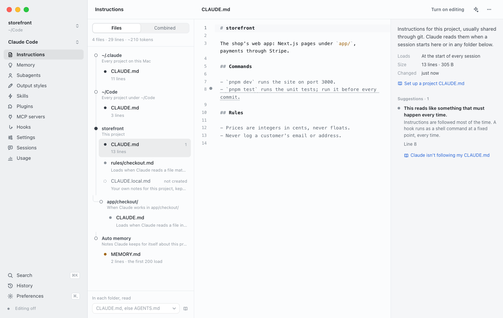
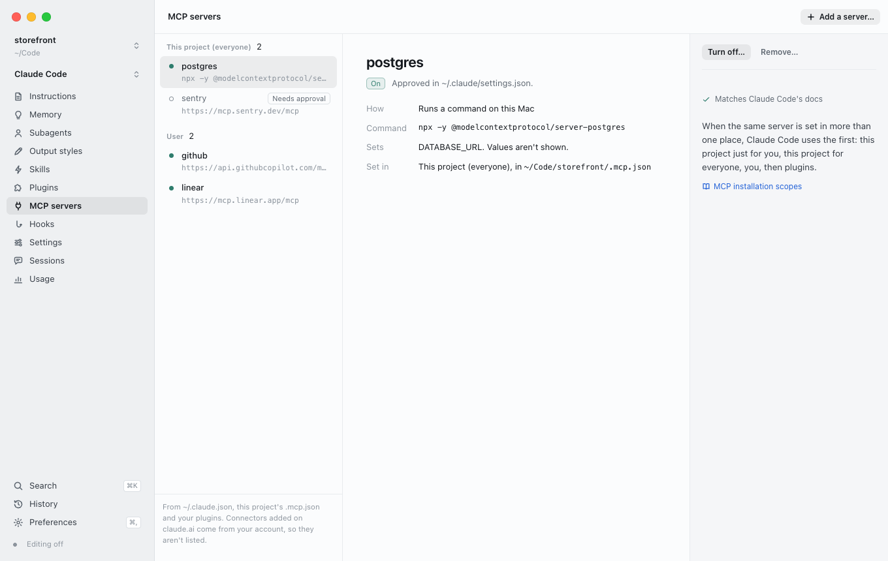
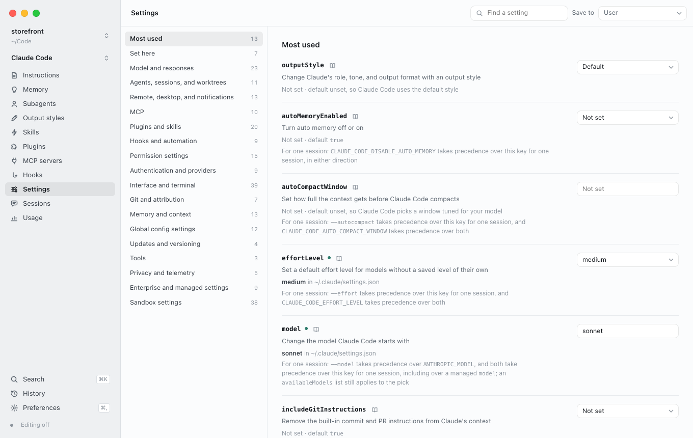
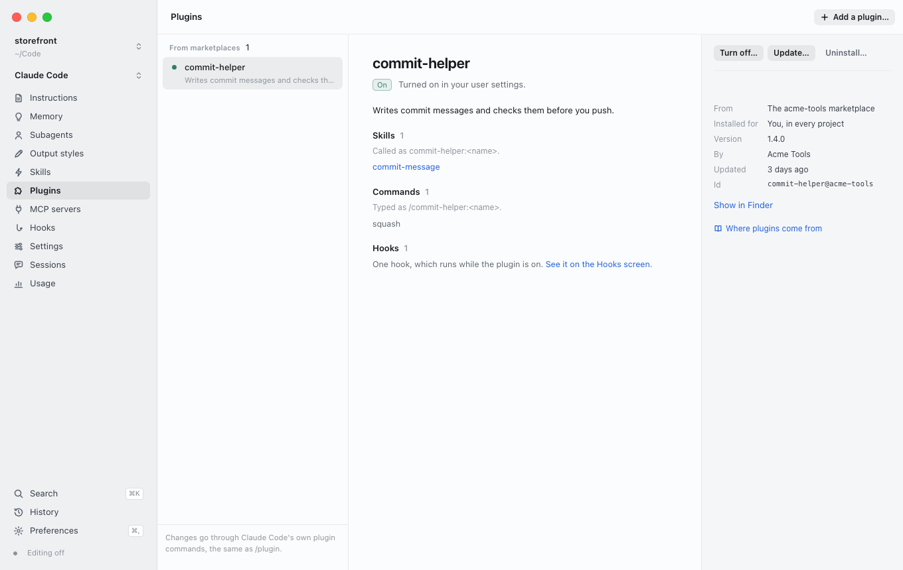
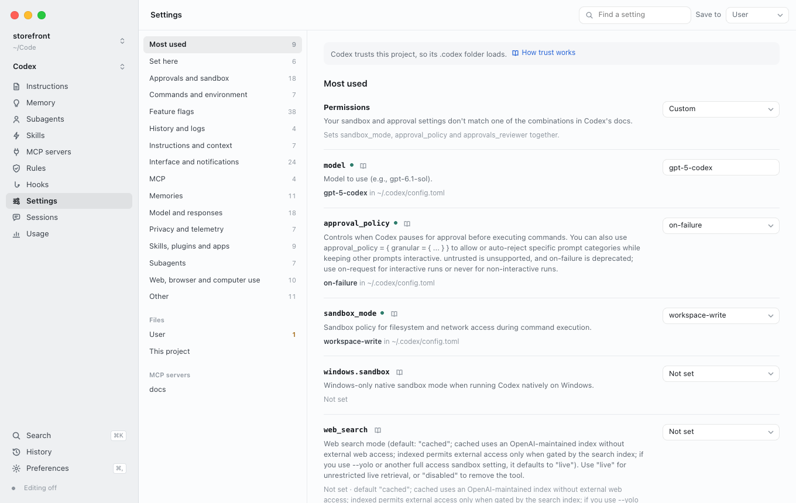

<div align="center">



# AgentCP

**Manage Claude Code and Codex in one place.**

<p>
  
  
  
</p>

<!-- Earned badges go on this line once they exist: Trendshift's "Repository of the day" and Product Hunt's "Product of the day". Never add one before it's earned. -->

<p>
  <a href="https://github.com/n0ah37/agentcp/releases/latest"></a>
  <a href="https://github.com/n0ah37/agentcp/releases"></a>
  
  
  <a href="LICENSE"></a>
  <a href="https://github.com/n0ah37/agentcp/stargazers"></a>
</p>

<h3>
  <a href="https://github.com/n0ah37/agentcp/releases/latest/download/AgentCP.dmg">Download for Mac</a>
  &nbsp;·&nbsp;
  <a href="https://agentcp.noahgeneralgroup.com">Website</a>
  &nbsp;·&nbsp;
  <a href="https://agentcp.noahgeneralgroup.com/demo/">Try it in your browser</a>
</h3>

<br>

<picture>
  <source media="(prefers-color-scheme: dark)" srcset=".github/assets/hero-dark.png">
  
</picture>

<p><a href="https://agentcp.noahgeneralgroup.com/#tour"><b>▶ Watch the one-minute tour</b></a></p>

</div>

<br>

AgentCP is a free Mac app that lists the instructions, memory, skills, subagents, plugins, MCP servers, hooks and settings each agent loads, in the order it loads them, says why a file doesn't load, and checks each one against the agent's own documentation.

When an agent ignores something you told it, the cause is usually in one of these files: a CLAUDE.md that never loaded, a setting another file overrides, an AGENTS.md that Codex cuts off at its 32 KiB limit. AgentCP shows you which.

It's open source under the MIT License, and everything stays on your Mac.

## What it shows

| | Claude Code | Codex |
| :- | :- | :- |
| **Instructions** | CLAUDE.md, CLAUDE.local.md, AGENTS.md, rules and imports, folder by folder | AGENTS.md from the project root down, and where the size limit cuts it |
| **Memory** | Auto memory, and the lines of MEMORY.md that load | Memories |
| **Skills and subagents** | Yours, the project's and your plugins' | Yours and the project's |
| **Plugins** | Where each one came from, the file that turned it on, and what it adds | Not yet: Codex's docs don't say where it keeps them |
| **MCP servers** | Local, project, user, plugin and organization servers, in the order Claude Code uses them | `[mcp_servers]` in your config and a trusted project's |
| **Hooks** | Every event, what it can stop, your hooks and your plugins' | `hooks.json` and `[hooks]` |
| **Settings** | Every setting, the value in force, and the file that set it | `config.toml`, layer by layer |
| **Sessions and usage** | Past sessions, what each changed, and tokens by day, model and folder | The same, from Codex's own session files |

<table>
  <tr>
    <td width="50%">
      <picture>
        <source media="(prefers-color-scheme: dark)" srcset=".github/assets/mcp-dark.png">
        
      </picture>
      <p align="center">MCP servers, and why each one is or isn't used</p>
    </td>
    <td width="50%">
      <picture>
        <source media="(prefers-color-scheme: dark)" srcset=".github/assets/settings-dark.png">
        
      </picture>
      <p align="center">Settings, with the file that decided each value</p>
    </td>
  </tr>
  <tr>
    <td width="50%">
      <picture>
        <source media="(prefers-color-scheme: dark)" srcset=".github/assets/plugins-dark.png">
        
      </picture>
      <p align="center">Plugins, and what each one adds</p>
    </td>
    <td width="50%">
      <picture>
        <source media="(prefers-color-scheme: dark)" srcset=".github/assets/codex-settings-dark.png">
        
      </picture>
      <p align="center">Codex's config.toml, layer by layer</p>
    </td>
  </tr>
</table>

## How the checks work

AgentCP keeps a copy of Claude Code's and Codex's documentation, and every suggestion quotes the sentence it's based on. When a docs update removes that sentence, the check says so in the app instead of guessing, and the tests fail until the check is fixed.

## Install

1. [Download AgentCP.dmg](https://github.com/n0ah37/agentcp/releases/latest/download/AgentCP.dmg). It needs a Mac with Apple silicon and macOS 13 or later.
2. Open it and drag AgentCP to Applications.
3. Open AgentCP. Setup finds Claude Code and Codex and looks for your projects in your home folder.

Or with Homebrew: `brew install --cask n0ah37/tap/agentcp`.

AgentCP is signed and notarized by Apple. It checks GitHub for a new version once a day and installs it when you quit; you can turn that off in Preferences.

## Privacy

- AgentCP reads your files where they are. There's no account, no analytics and no crash reporting.
- It goes online for two things only: downloading the agents' documentation when you ask, and checking GitHub for a new version.
- Editing is off until you turn it on. Every change is shown before it's saved, and History keeps the version before it.
- MCP server secrets stay hidden: environment variables and headers are listed by name only.

## Build from source

```bash
git clone https://github.com/n0ah37/agentcp
cd agentcp
pnpm install
pnpm run docs   # download Claude Code's and Codex's documentation
pnpm app    # build it and open the desktop app
```

`pnpm dev` runs the same app in your browser, and `pnpm test` runs the engine's tests against a throwaway home folder, never your own.

| Folder | What's in it |
| :- | :- |
| `engine/` | Node, and the only code that reads or writes files: a local server on 127.0.0.1 with a new token each launch |
| `app/` | The interface, in React with CodeMirror |
| `desktop/` | The Electron app around them |
| `shared/` | The types the engine and the interface share |

## Questions

<details>
<summary><b>Why not /context or /memory?</b></summary>

Those show what loaded in the session you're in, for one project and one agent. AgentCP shows every project on your Mac, outside a session, for both agents, with the reason each file loads or doesn't.
</details>

<details>
<summary><b>Does it change my files?</b></summary>

Only once you turn on editing, and only after you've seen the change. Every save, new file, rename and deletion is kept in History, so you can put the file back as it was.
</details>

<details>
<summary><b>Does it run on Intel Macs?</b></summary>

Not yet. The release is built for Apple silicon only.
</details>

<details>
<summary><b>Does it work with Cursor or OpenCode?</b></summary>

Not yet. AgentCP reads each agent's files the way that agent's documentation describes them, and it covers Claude Code and Codex today.
</details>

<details>
<summary><b>Why isn't it on the Mac App Store?</b></summary>

Mac App Store apps run in a sandbox that can't read `~/.claude`, `~/.codex` or your project folders.
</details>

<details>
<summary><b>Is AgentCP made by Anthropic or OpenAI?</b></summary>

No. AgentCP is an independent app by Noah General Group Inc. Claude Code is made by Anthropic and Codex by OpenAI.
</details>

## Contributing

Bug reports and pull requests are welcome. Read [CONTRIBUTING.md](CONTRIBUTING.md) first, and report security problems privately as [SECURITY.md](SECURITY.md) describes.

## License

[MIT](LICENSE) © 2026 Noah General Group Inc.

<div align="center">
<br>

<a href="https://star-history.com/#n0ah37/agentcp&Date">
  <picture>
    <source media="(prefers-color-scheme: dark)" srcset="https://api.star-history.com/svg?repos=n0ah37/agentcp&type=Date&theme=dark">
    
  </picture>
</a>

</div>
